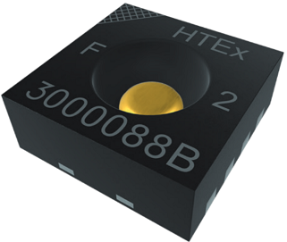
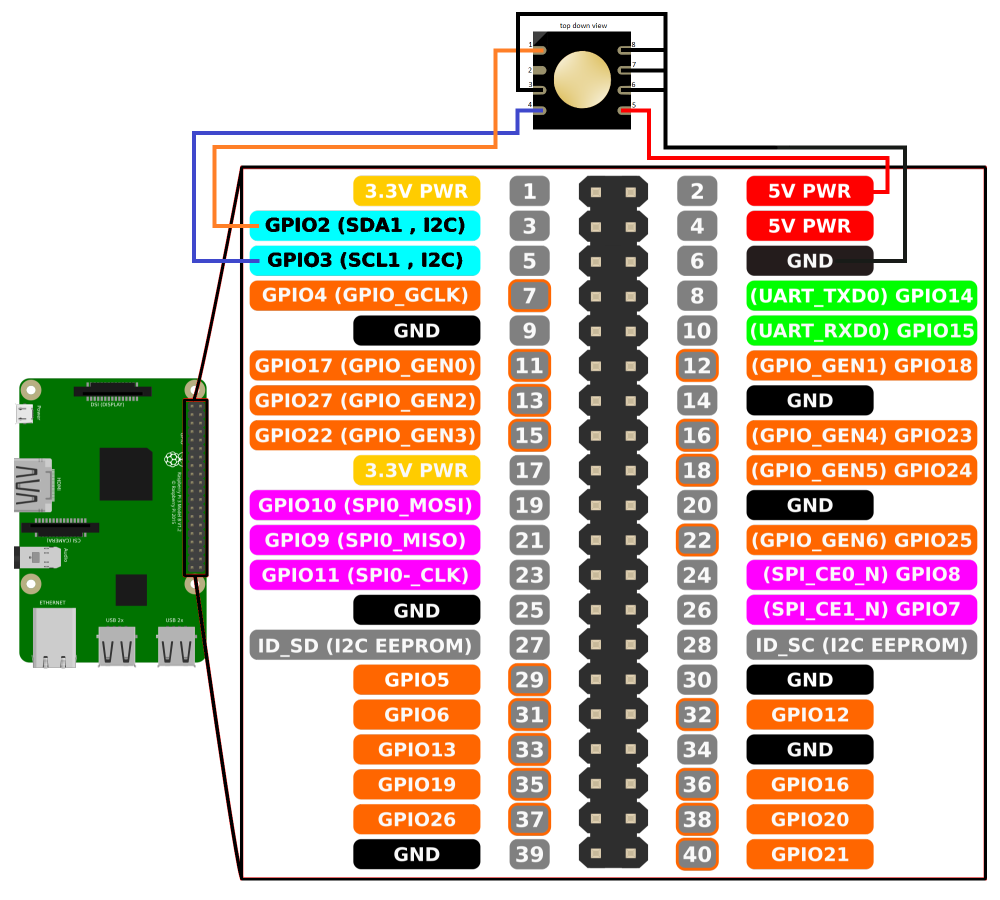

[](https://www.epluse.com/en/)

# HTE501 I2C with Raspberry Pi 


 


[](https://www.epluse.com/products/humidity-instruments/humidity-sensing-elements/hte501/)   [](https://www.epluse.com/fileadmin/data/product/hte501/datasheet_HTE501.pdf) 


## QUICK START GUIDE  

### Components 
- HTE501
- Raspberry Pi 4
- Breadboard 
- Wire jumper cable <br>

| Step |                                                                                                                                                             |
|------|-------------------------------------------------------------------------------------------------------------------------------------------------------------|
| 1    | Connect the HTE501 sensor module with Raspberry Pi according to the following scheme:<br>__Please note: For this connection scheme the I2C address is 0x40.__ <br>  [](images/HTE501_rpi.png)|
| 2    | Download and install the operating system (https://www.raspberrypi.org/software/operating-systems/).                                                            |
| 3    | Boot Raspberry Pi and complete any first-time setup if necessary (find instructions online).                                                                |
| 4    | Activate I2C communication:https://github.com/fivdi/i2c-bus/blob/master/doc/raspberry-pi-i2c.md                     |
| 5    | Download and install the "smbus2" library on the Raspberry Pi. [Instruction](https://pypi.org/project/smbus2/#:~:text=Installation%20instructions)            |
| 6    | Clone the repository: ```git clone https://github.com/epluse/hte501_i2c_rpi.git```  |
| 7    | Open a command shell and type following command to receive measurement data – that’s it! |


### Example output

```shell
pi@raspberrypi:~ $ python3 hte501_i2c_example.py
	temperature , relative humidity, dewpoint
	23.41 °C , 50.64 %RH , 13,6 °C
```
<br>


### I2C addresse 
The sensor‘s I2C base address is 0x40 (without R/W bit). Pins A1...A3 overrule the I2C base address.(for more information check the data sheet) <br>
### No matching I2C addresse
You have two ways to match the I2C addresses. The first would be to call the library in the Python file with the correct address. Or you can change the connections to the pins A1 to A3.
<br> 
<br>

## License 
See [LICENSE](LICENSE).
